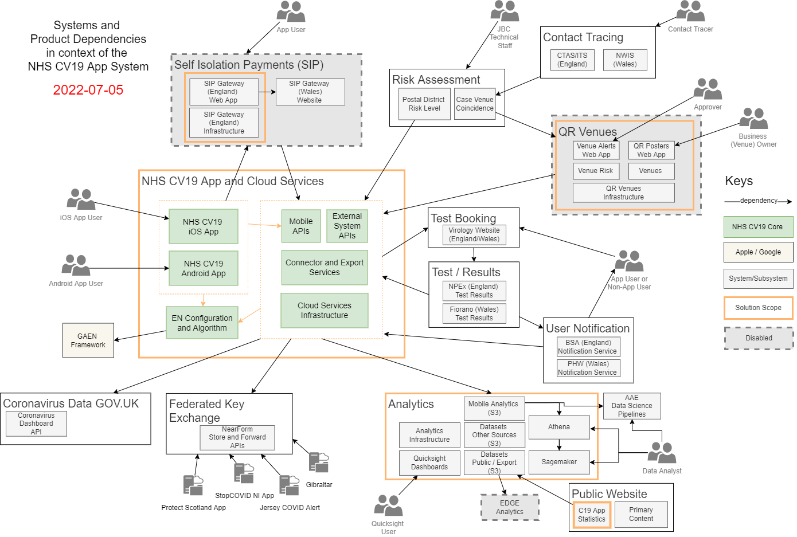
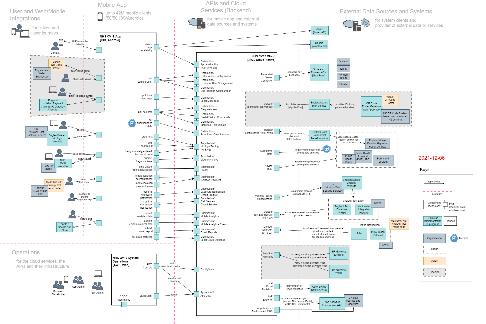

# NHS COVID-19 App System | Architecture Guidebook

This is a living guidebook and unique point of architectural reference for the NHS COVID-19 App System

## Table of Contents

- [Context](#context)
- [Functional Architecture](#functional-architecture)
- [System Overview](#system-overview)
- [System Architecture](#system-architecture)
- [System Behaviour](#system-behaviour)
- [System APIs and Interfaces](#system-apis-and-interfaces)
- [Tech Stacks and Repositories](#tech-stacks-and-repositories)
- [Infrastructure](#infrastructure)

## Context

The NHS COVID-19 App is about speed, precision and reach in the context of the Test & Trace programme. It triggers isolation advice in minutes, measures encounters in time and approximate
distance and can alert those you have had contact with  -  all while protecting your privacy.

- Trace: Get alerted you if you’ve been near other app users who have tested positive for coronavirus.
- Alert:  Keep aware of the level of coronavirus risk in your postcode district.
- Check-in: Record the venues you attend and get alerted if a venue is later found to have been at risk from coronavirus.
- Symptoms: Check if you have coronavirus symptoms and whether you need to order a free test.
- Test: Get help with booking a test and accessing the result quickly.
- Isolate: Keep track of your self-isolation countdown and access relevant advice.

> App statistics are available online at [https://stats.app.covid19.nhs.uk](https://stats.app.covid19.nhs.uk/)

## Functional Architecture

The COVID-19 App System is a composition of different functional, technical and organisational domains, related to each other by different app user journeys:

### Domain Model

- **App Settings and Onboarding** allows the user to accept terms and conditions, make a language selection and set their postcode district
- **Rate the App** encourages regular collection of user feedback following venue check-in
- **Encounter Detection** is where anonymous keys are exchanged with contacts and a recent history of exposure keys is maintained for use in **Exposure Notification**
- **Area Risk Levels** highlight the risk in the users local area.  High risk postcodes are polled periodically and matched with the user's postcode district
- **Exposure Notification** is triggered when diagnosis keys, shared by those known to have tested positive, are polled periodically and matched, using the [Exposure Notification framework](#gaen-framework), against the user's own recent exposure history
- **Virology Test** booking is offered once the user receives **Isolation Advice**
- **Isolation Advice**, when triggered by a positive **Virology Test** result or **Exposure Notification**, results in a subsequent **Diagnosis Key Submission**, if the user consents to helping to stop the spread of coronavirus
- An **Isolation Payment Claim** is offered when **Isolation Advice** is triggered by an **Exposure Notification**

User notifications can be triggered by either risky venues matching visited venues, or area risk levels matching the users specified postcode district level.  The important difference between a user notification and an **Exposure Notification** is that the latter always and only refers to diagnosis key matches for cascading contacts from an index case. User notifications in contrast are triggered only by and for user owned data like postcode districts or QR codes of visited venues.

Only the app and system analytics uses anonymised usage or installation related data. The design and implementation addresses, in particular, all privacy and security concerns of NCSC, the ICO and the GAEN Framework T&Cs.

#### External Domain Dependencies

- Encounter detection depends on the Apple / Google mobile platform, user devices with their iOS and Android OS and their implementation of the GAEN Framework.
- Symptoms, Isolation advice and the Isolation payment claims depend on approved policies and data from UK health authorities and government.
- Virology testing depends on UK test booking web sites. And testing labs with their specific organisation, processes and technical interfaces, test result notification services and processes for manual token distribution depend on APIs provided by that domain
- Venue check-in depends on the QR system with the two components for generating QR Posters and for labelling venues as a risk venue (used by PHE, CTAS)
- Import of area risk levels depends on corresponding CV19 related data sources from PHE, JBC and Local Authorities
- Isolation payment claims depend on SIP gateway web sites to check eligibility, authenticate and make the payment claim.

### GAEN Framework

Our concepts make use of terminology from the [Google and Apple Exposure Notification (GAEN)](https://www.google.com/covid19/exposurenotifications/) framework. See the [GAEN API](https://developers.google.com/android/exposure-notifications/exposure-notifications-api) for detailed data models and concept definitions.

Our use of the GAEN framework and it's versions and core behaviour is described in [gaen.md](gaen.md).

## System Overview

The NHS COVID-19 App and Cloud Services (COVID-19 App System) has five major parts: Mobile apps, Cloud backend with API services, Infrastructure, Exposure Notification (EN) configuration and algorithm, and Dependent systems.

### Principles

The system adheres to the following principles

1. No User State or Identifier is stored on the Cloud Services
1. All APIs are stateless where possible
1. When stateful behaviour is required, short-lived tokens are used as identifiers. They exist only as long as they are needed
1. Mobile analytics are collected, completely anonymously. A user’s IP addresses will not be stored by the functional App System
1. External system integration follows an API-first approach

Note that where HTTPS is used, such as between the mobile device and the API services, no IP addresses transferred by Internet network providers are stored in the App System backend.

## System Architecture

The system architecture diagram below specifies the complete system showing the main system components with their communication ports, and integrations within each other:

- Android and iOS native mobile apps implement the user-centric vision of the Test and Trace application. We use the EN Framework provided by Apple and Google to implement encounter detection based on Bluetooth Low Energy (BLE) attenuation duration.
- APIs and Cloud Services (Backend) are implemented using an AWS cloud-native serverless architecture and provided to mobile clients as APIs. For the implementation of the services we use AWS Lambdas.
- The integration of external systems is implemented by the backend, again following an API-driven approach for all provided interfaces. For exporting or providing data there are connector or exporter implementations, again using AWS Lambdas.
- As part of Operations, web clients for smaller internal user groups and stakeholders are implemented as SPAs (single page applications), predominantly React, which could be hosted on S3.
- Security and operations are built on AWS cloud-native components.

The port names in the system architecture are usually defined by `API Group/API Name`, e.g. `Submission/Diagnosis Key`.

## System Behaviour

Key user journeys, along with representative UML sequence diagrams are listed in [journeys.md](journeys.md)

## System APIs and Interfaces

The Cloud Services ports in the system architecture are implemented by API services and Interfaces, grouped into a small number of fundamental concepts and architectural patterns:

| API Pattern | Description |
| ----------- | ----------- |
| Submission  | Mobile data submission to backend |
| Distribution| Distribution of data and configuration to mobile apps |
| Upload       | External systems data communicated to app backend - within NHS remit|
| Circuit Breaker | Control valve to enable, delay, or disable certain types of user notifications |
| Connector | Connections to external systems |
| Exporter |  Data Exports to other systems |

These are described in more detail in [api-patterns.md](api-patterns.md)

The following solution patterns take characteristics of these groups into account. The patterns are applied in specific [API contracts](api-contracts/README.md), provided by the cloud services backend and consumed by mobile or external systems. We use an API specification by example approach based on semi-formal .md files.

### API Foundations

Base principles for communicating over the internet are described in [api-foundation.md](api-foundation.md) and API security in [api-security.md](api-security.md)

## Tech Stacks and Repositories

The [system repository](https://github.com/nihp-public/covid19-app-system-public) includes the implementation of all services required to collect data and interact with the mobile devices and external systems
and the code to automate build, deployment and test of the services. The **APIs and Cloud Services** are implemented using

- Run: AWS, Java and Kotlin
- Build and Deploy: Ruby and Terraform
- Test: Robot Framework (Python), JUnit/Kotlin

The AWS cloud-native implementation uses API gateways acting as a facade for serverless functions with mostly S3 buckets for storage. The services are configured using Terraform source code files. Payloads are signed using KMS. Some patterns require more DB like persistence where we use DynamoDB. Finally some services and storage components require time triggers or time related functions and AWS features such as retention policies for S3 buckets.

Note that our build system and deployment architecture is currently used only internally. Documentation will be added to the open source repository as soon as these internal components for development and delivery become relevant for public development.

The **iOS app** only uses standard Apple tooling, all bundled within Xcode.

- [Application source code](https://github.com/nihp-public/covid-19-app-ios-ag-public)
- [Architecture and module definitions](https://github.com/nihp-public/covid-19-app-ios-ag-public/blob/master/Docs/AppArchitecture.md)
- [Internal and external dependencies](https://github.com/nihp-public/covid-19-app-ios-ag-public#dependencies)

The **Android app** uses standard Android tooling, Kotlin and Android SDK. The build uses Gradle with a couple of third party Gradle plugins for publishing and protobuf (only for field test).

- [Application source code](https://github.com/nihp-public/covid-19-app-android-ag-public)
- [Internal and external dependencies](https://github.com/nihp-public/covid-19-app-android-ag-public/blob/master/app/build.gradle)

The **Web apps** use React SPA hosted on S3, delivered by CDN. However, note that the current system does not provide any public available web client.  Once there is a public web client, a section will be added.

## Infrastructure

The COVID-19 App System infrastructure and operations uses AWS cloud-native components like Route53, AWS CDN, API Gateways, Lambdas and S3. The infrastructure components implement support for

- Mobile app integration
- API services
- Third party system integration
- Operations
- CDOC integration

